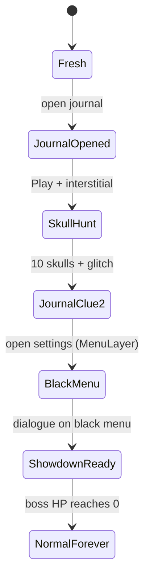

# The Hollow — design & implementation

This document is for developers and index reviewers. It explains how the ARG is structured in code so you can verify the project is maintained and understood, not pasted blindly.

Player-facing spoilers are limited to structure (phases exist, skulls exist). Exact puzzle solutions stay in-game.

## Story beats (phase machine)

Progress is stored in `HollowState` (`src/HollowState.hpp`). Phases advance in order:

| Phase | Meaning |
|-------|---------|
| `Fresh` | Mod enabled; journal not opened yet |
| `JournalOpened` | Player opened the journal once |
| `SkullHunt` | Play shows interstitial; skulls active on menu layers |
| `JournalClue2` | All skulls collected; SETTINGS anagram clue in journal |
| `BlackMenu` | Opening settings from main menu triggers `game::restart` |
| `ShowdownReady` | Black-menu dialogue done; Play opens boss layer |
| `NormalForever` | Boss defeated; vanilla menu behavior restored |



### Key transitions (where in code)

- **Journal → hunt:** `HollowJournalLayer` sets `JournalOpened`; `MenuLayer::onPlay` shows `HollowInterstitialLayer` then `SkullHunt`.
- **Last skull:** `HollowSkulls.cpp` runs glitch, adds `CLUE_SETTINGS`, pushes journal (`JournalClue2`).
- **Settings betrayal:** `MenuLayer::onOptions` when `JournalClue2` + `settingsUnlocked()` → `BlackMenu` + restart.
- **Finale:** `MenuLayer` black overlay + two-step popup → `ShowdownReady`; `onPlay` → `HollowBossLayer`; kill → `NormalForever`.

## SETTINGS clue

The anagram is a constant in `HollowState.hpp`:

```cpp
CLUE_SETTINGS = "someS errorsT triggerT terribleE instabilitiesN negatingI gameG stability.S"
```

Capital letters spell **SETTINGS**. The journal renders collected clue strings; opening the real options menu after this phase is the intended player action.

## Skull hunt (10 collectibles)

Skulls only spawn when `phase == SkullHunt`. Each hook file places one indexed skull with normalized coordinates (resolution-independent).

| Index | Hook file | GD layer |
|------:|-----------|----------|
| 0 | `hooks/MenuLayer.cpp` | Main menu |
| 1 | `hooks/LevelSelectLayer.cpp` | Level select |
| 2 | `hooks/CreatorLayer.cpp` | Creator |
| 3 | `hooks/GJGarageLayer.cpp` | Garage |
| 4 | `hooks/LeaderboardsLayer.cpp` | Leaderboards |
| 5 | `hooks/OptionsLayer.cpp` | Options (in-menu) |
| 6 | `hooks/SecretRewardsLayer.cpp` | Secret rewards |
| 7 | `hooks/LevelBrowserLayer.cpp` | Level browser |
| 8 | `hooks/AchievementsLayer.cpp` | Achievements |
| 9 | `hooks/MoreOptionsLayer.cpp` | More options |

Pickup logic: `HollowSkulls.cpp` (`markSkullFound`, bitmask save). At 10/10, `runGlitchEffect` then journal with new clue.

## Persistence (save keys)

All values go through `Mod::setSavedValue` in `HollowState::save()`:

| Key | Type | Content |
|-----|------|---------|
| `hollow-phase` | int | `Phase` enum |
| `hollow-skulls` | int | Bitmask, bit `i` = skull `i` |
| `hollow-clues` | string vector | Journal clue lines |
| `hollow-interstitial` | bool | FIND THE SKULLS interstitial shown |
| `hollow-settings-unlocked` | bool | SETTINGS phase active |
| `hollow-black-dialogue` | bool | Black menu script finished |
| `hollow-journey-begun` | bool | One-time journey popup in journal |

`resetARG()` clears all of the above (wired to the **Reset ARG progress** button in `main.cpp`).

## Boss (`HollowBossLayer`)

- 5 HP, tap boss sprite to damage.
- Random dodge positions inside screen margins; auto-dodge on a timer.
- `Fight` intro alert; `Retreat` leaves the layer.
- On kill: phase → `NormalForever`, quit flow via existing popup chain.

Tuning constants live at the top of `HollowBossLayer.cpp` (dodge intervals, arena margins).

## Compatibility choices

- **Node IDs** dependency for `bottom-menu` / `side-menu` when placing the journal button.
- Popups during `MenuLayer::init` are **deferred** (`CCDelayTime`) — immediate FLAlert in init was crashing; comment documents that in `MenuLayer.cpp`.
- Black menu dialogue uses **Listen** / **Return** only (no OK on the first step) so `btn2` handling does not skip the chain.
- Boss texture path `HollowBoss.png` at resources root (not `ui/…`) so the sprite loads from the mod package.

## Mod logo FX

`HollowModLogoFX.cpp` listens to `ModLogoUIEvent` and attaches glitch/shard particles to this mod’s logo in the Geode UI — cosmetic, does not affect ARG state.

## Files worth reading first

1. `src/HollowState.hpp` — phases, clue constant, skull count  
2. `src/hooks/MenuLayer.cpp` — journal, play intercept, settings restart, black menu  
3. `src/HollowSkulls.cpp` — collection + glitch handoff  
4. `src/layers/HollowJournalLayer.cpp` — journal UI and journey popup  
5. `src/layers/HollowBossLayer.cpp` — finale fight  

## Maintenance notes

- Bump `version` in `mod.json` and `changelog.md` together for releases.
- `logo.png` must stay **1:1** (square) for index validation.
- Do not replace an existing GitHub release asset in place; upload a new release so the index hash stays valid.
