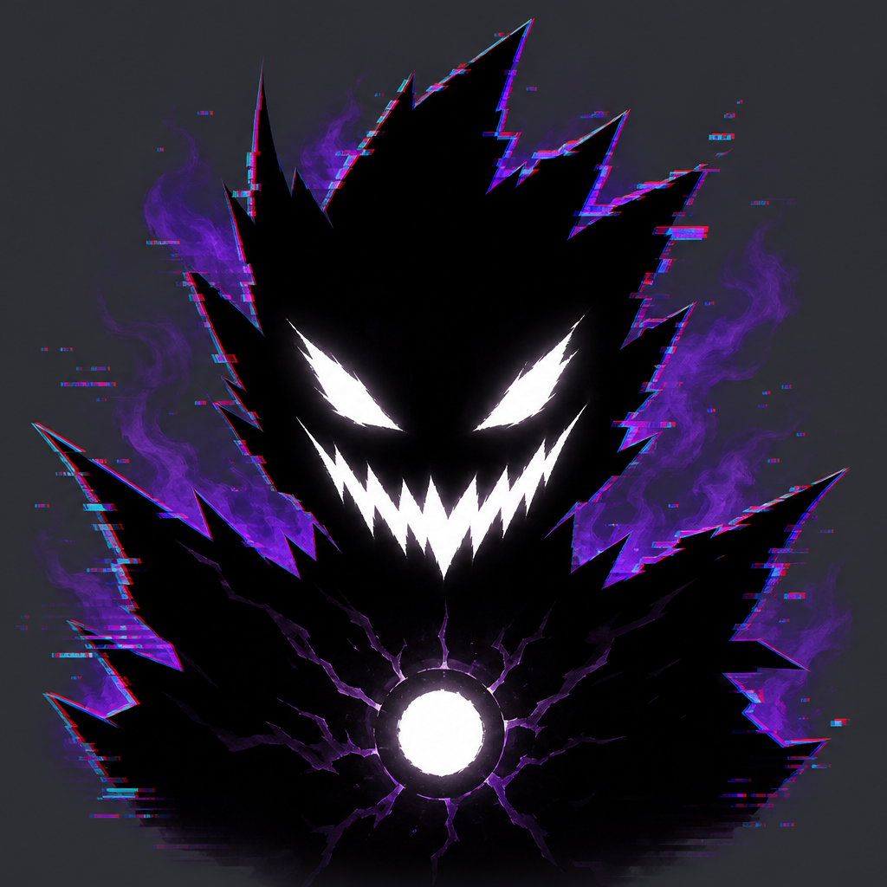

# The Hollow

An in-game alternate reality game for Geometry Dash, built with [Geode](https://geode-sdk.org/). No external websites or files — the story plays out in menus you already use.

**Mod ID:** `gdplatformmaker.the-hollow`  
**Author:** [aidmet](https://github.com/aidmet) (GDPlatformMaker)  
**Source:** https://github.com/aidmet/TheHollow



## What this mod is

After you enable the mod, the main menu stops feeling quite right: a journal appears, hidden skulls wait on familiar screens, and the Hollow pushes back once you have seen enough. The finale uses settings and a short boss sequence — see [about.md](about.md) for a **spoiler-free** player guide.

This repository is the full source for that experience. Design intent, phase flow, and where code lives are documented in [DESIGN.md](DESIGN.md) for anyone reviewing or contributing.

## Requirements

- Geometry Dash **2.2081**
- Geode **5.7.1** or newer
- Dependency: [Node IDs](https://github.com/geode-sdk/NodeIDs) (`geode.node-ids`)

## Install (players)

1. Install Geode for your platform.
2. Download `gdplatformmaker.the-hollow.geode` from [Releases](https://github.com/aidmet/TheHollow/releases) (or the Geode index when listed).
3. Place the file in your Geode `mods` folder, or install from **Geode → Download** if available.
4. Enable **The Hollow** and return to the main menu.

## Build (developers)

```sh
geode build
```

Output: `gdplatformmaker.the-hollow.geode` in the build output directory.

CI builds all platforms via [.github/workflows/multi-platform.yml](.github/workflows/multi-platform.yml). Index submissions should use the `.geode` from those artifacts, not a one-off local build when possible.

Optional, for IDE support:

```powershell
./scripts/generate-compile-commands.ps1
```

## Project layout

| Path | Role |
|------|------|
| `src/HollowState.*` | ARG phase machine and save data |
| `src/HollowSkulls.*` | Skull pickup and all-skulls glitch handoff |
| `src/hooks/*.cpp` | Per-layer hooks (menu screens + skull placement) |
| `src/layers/*.cpp` | Journal, interstitial, glitch, boss |
| `src/HollowModLogoFX.*` | Mod logo glitch effect in the Geode UI |
| `resources/*.png` | Sprites (journal button, skull, boss) |
| `about.md` | In-game description (Geode mod page) |
| `changelog.md` | Release notes |

## Settings

**Reset ARG progress** (in mod settings) clears phase, skulls, and clues so you can run the story again on the same save.

## License / assets

Code in this repo is the mod implementation. Geometry Dash and Geode are their respective owners. Custom art lives under `resources/` and `logo.png`.

## For index reviewers

This mod was authored and tested by the repository owner. The ARG structure (phases, clue text, skull layers, settings restart, boss) is intentional — not a generated template port. See [DESIGN.md](DESIGN.md) for the state machine, save keys, and file map. Questions about specific behavior can be answered by pointing at the cited source files.
